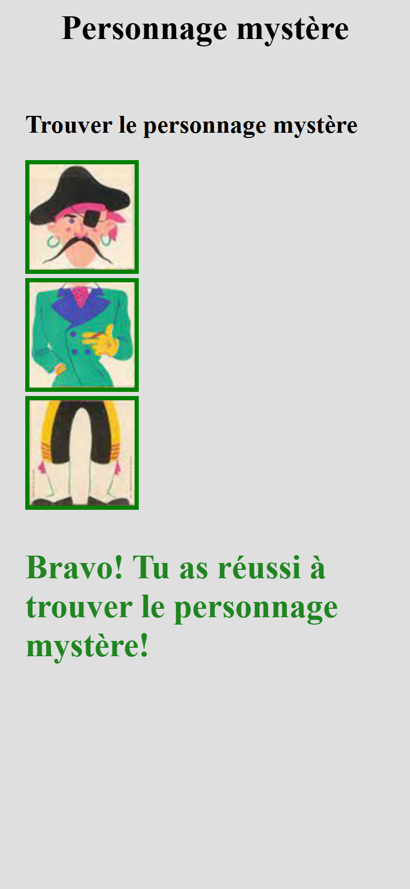

# mix-and-match

Three stacked pictures, a head, a body and a pair of legs, each cycling
through ten variants when clicked. Somewhere among the thousand combinations
hides one character; find it and the page says so.

Plain HTML, CSS and JavaScript. No framework, no build step, no dependency:
open the file and click.

## Screenshots

## How it works

**One handler for three pictures.** Each picture sits in a button, and the
three buttons share the same `changerImage` listener. `e.currentTarget` is
the button that was pressed, its picture is the one to advance. Nothing is
duplicated per body part.

**The file name is the state.** There is no counter. `lirePartieEtIndex`
reads `images/bas7.jpg` and returns `bas` and `7`; the next picture is
`(7 + 1) % 10`, so `bas9` wraps to `bas0`. The folder, the extension, the
number of variants and the mystery character are constants at the top of the
script, the only lines to touch for another set of pictures.

**Found means all three match.** After every click, `verifierPersonnage`
compares the three current numbers with the mystery character. When they
match, each picture gets the `bonne-selection` class, the green frame, and
the message loses `cacher`. Move away from the character and both go again.

**The pictures are buttons, so the keyboard works for free.** Tab reaches
each one, Enter and Space play a turn, and the browser does all of it; the
script has no keyboard code. Two stylesheet rules strip the button's padding
and background so the page is, to the pixel, the one where the pictures were
bare.

## Running it

Open `index.html` in a browser. There is nothing to install.

## Stack

HTML, CSS and vanilla JavaScript. One stylesheet, one script, thirty pictures.

## Résumé

Trois images empilées, une tête, un corps, des jambes, chacune parcourant dix
variantes au clic ; parmi les mille combinaisons se cache un personnage, et
la page l'annonce quand on le trouve. Une seule fonction sert les trois
images : chacune est dans un bouton, les trois boutons partagent le même
écouteur, et `e.currentTarget` désigne celui qui a été pressé. L'état est le
nom du fichier lui-même, « images/bas7.jpg » donne la partie et le numéro, et
le suivant est le numéro plus un modulo dix. Le dossier, l'extension, le
nombre de variantes et le personnage mystère sont des constantes en tête du
script. À chaque clic, la sélection est comparée au personnage : si les trois
parties correspondent, les cadres verts et le message apparaissent, et ils
disparaissent dès qu'on s'en éloigne. Les boutons donnent le clavier sans
une ligne de code.

## Licence

MIT. See [LICENSE](LICENSE).
